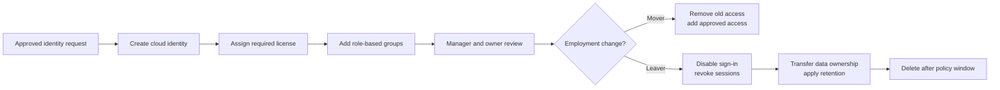

# Identity Lifecycle and Access Review

**Source:** Coursework-derived case study, independently rewritten  
**Status:** Complete analytical case study

## Scenario

A fictional organization needs a consistent joiner-mover-leaver process. Informal account creation has produced stale access, direct role assignments, and groups without accountable owners.

## Control design

## Administrative model

- Group-based access is preferred over direct user permissions.
- Each access group has a documented purpose and accountable owner.
- Privileged roles use eligible, time-limited assignments when supported.
- Guest accounts have sponsors and expiration or review dates.
- Leaver actions include session revocation, group removal, device review, and data-ownership transfer.

## Validation matrix

| Lifecycle stage | Check | Expected result |
|---|---|---|
| Joiner | Review assigned licenses and groups | Only approved services and role groups are present |
| Mover | Compare old and new access requirements | Previous-department access is removed |
| Privileged assignment | Review role state and justification | Eligible or time-bound access replaces standing privilege |
| Guest review | Confirm sponsor and business purpose | Unsupported guests are removed or blocked |
| Leaver | Attempt sign-in after disablement and session revocation | Access is denied and the event is auditable |

## Security impact

The workflow reduces privilege accumulation, orphaned accounts, undocumented guest access, and inconsistent offboarding. It does not replace application-level authorization reviews or HR/legal retention requirements.

## Lessons learned

Identity administration is not only account creation. A defensible process connects approvals, group ownership, role design, logging, periodic review, offboarding, and data retention.
